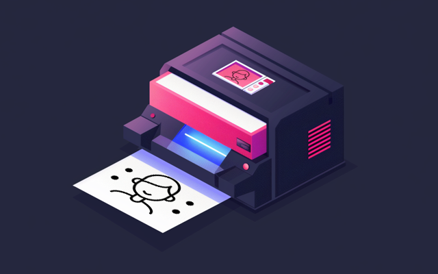
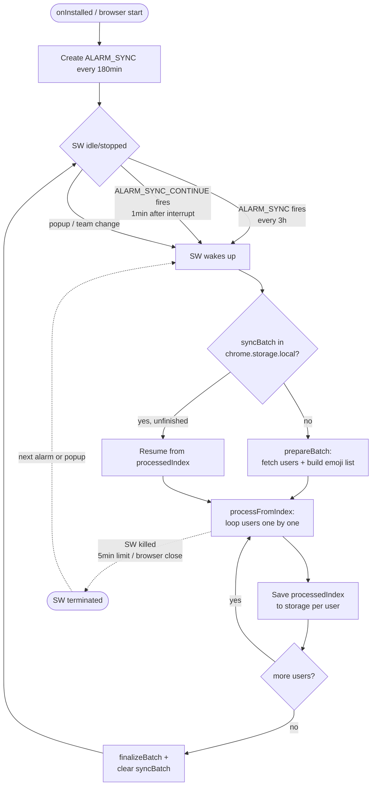

# Uemoji

  

Registers the profile images of all users in Slack team as custom emojis.

The setup is completed in the following 3 steps:

1. Add Uemoji to Chrome.
2. Click the Uemoji icon.
3. Select the Slack team.

Features:

- No special authentication is required, but you must be logged into Slack in Chrome.
- Automatically process once a day.
- Add a custom emoji with a user name and register the display name of the user profile as aliases for that emoji. The display name is split with '/' or '|' and registered as multiple aliases.

## How sync works

The sync cycle is driven by `chrome.alarms` and resumable across Service Worker restarts. A periodic alarm fires every 3 hours and runs a batch over all users; progress is persisted per user, so a kill/restart picks up from the last processed index.

Slack rate limits (HTTP 429 with `Retry-After`, or HTTP 5xx) are handled inside `fetchSlackWithRetry` with header-driven sleep and exponential backoff, so the loop itself does not need to know about retries.

## Installation

### Chrome Web Store (recommended)

1. Open [chrome web store](https://chrome.google.com/webstore/detail/uemoji/) in Chrome.
1. Click `Add to Chrome`.

### Developer mode (early access)

1. Download `uemoji.zip` from [latest release](https://github.com/minodisk/uemoji/releases/latest).
1. Unzip `uemoji.zip`.
1. Open [chrome://extensions/](chrome://extensions/) in Chrome.
1. Turn on `Developer mode`.
1. Click `Load unpacked` and select unzipped directory.
